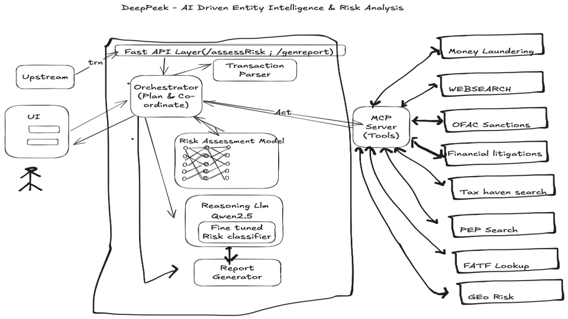
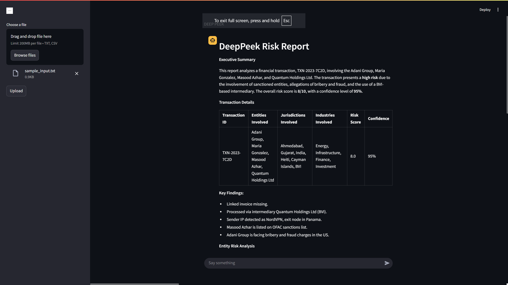
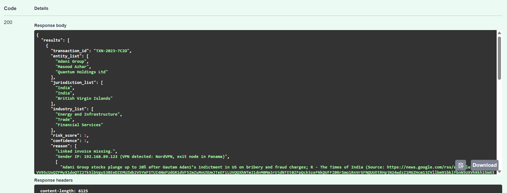
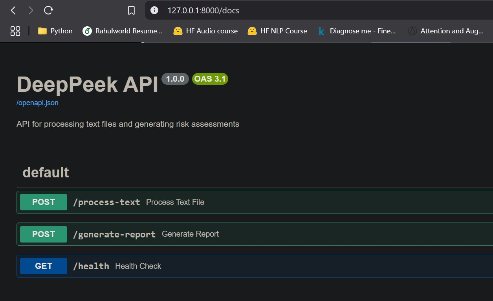

# 🚀 DeepPeek

## 📌 Table of Contents
- [Introduction](#introduction)
- [Demo](#demo)
- [Inspiration](#inspiration)
- [What It Does](#what-it-does)
- [How We Built It](#how-we-built-it)
- [Challenges We Faced](#challenges-we-faced)
- [How to Run](#how-to-run)
- [Tech Stack](#tech-stack)
- [Team](#team)

---

## 🎯 Introduction
DeepPeek is an AI-powered system designed to automate research and evidence-gathering for identifying, verifying, and risk-scoring entities involved in complex financial transactions. It helps reduce manual effort, improve accuracy, and integrate real-time updates for a robust risk evaluation mechanism.

## Architecture Diagram



## 🎥 Demo

https://github.com/user-attachments/assets/5d72d463-a72d-4abf-99ed-580093ac31bc


🖼️ Screenshots:

### Descriptive Report UI



### Response from FastAPI



## Sample generated Report
[Generated Report](artifacts/demo/sample generated pdf/Risk Report.pdf)

## 💡 Inspiration
Financial fraud, money laundering, and illicit transactions remain major challenges in the banking and financial sectors. Manually analyzing transaction data is time-consuming and prone to errors. DeepPeek automates this process, providing real-time risk analysis with supporting evidence.

## ⚙️ What It Does
- Extracts entities from structured and unstructured transaction data.
- Enriches extracted data with external sources such as financial APIs, regulatory databases, and news sources.
- Assesses transaction risk using multiple risk evaluation tools.
- Computes a final risk score, confidence level, and reasoning for each transaction.
- Generates detailed PDF reports for transaction risk assessments.

## 🛠️ How We Built It
DeepPeek is built using a multi-agent framework where a **Manager Agent** delegates tasks to specialized tools:
- **Web Search Agent**: Fetches relevant entity information via web search.
- **Risk Assessment Agent**: Calculates risk scores using various compliance and financial risk tools.
- **Risk Assessment Tools**:
   - **Legal Entity Identifier (LEI) Tool**
   - **OFAC Sanctions List Tool**
   - **Money Laundering, Fraud & Scandal News Retrieval Tool**
   - **Tax Haven Country Tool**
   - **PEP (Politically Exposed Persons) Tool**
   - **FATF (Financial Action Task Force) Tool**
   - **Geographical Risk Tool**

## 🚧 Challenges We Faced
- Integrating multiple external data sources.
- Developing an accurate and explainable risk-scoring mechanism.

## API Endpoints
- `/process-text` : generates raw findings in json format 
- `/generate-report` : generates a detailed descriptive final report with option to download as PDF

 
## 🏃 How to Run
1. Clone the repository
   ```sh
   git clone https://github.com/your-repo.git
   ```
2. Install dependencies
   ```sh
   pip install -r requirements.txt
   ```
3. Run the application
   ```sh ./code
   streamlit run chatbot.py
   ```
4. Run FastAPI endpoint
   ```sh
   cd ./code/src/api
   uvicorn app:app --reload
   ```


## 🏗️ Tech Stack
- **Backend**: Python, FastAPI
- **AI Models**: Hugging Face Transformers
- **UI Framework**: Streamlit
- **Tools & Frameworks**: SmolAgents, Pandas, NumPy, ReportLab (for PDF generation)

## 👥 Team
- **Samarth Mishra** - [GitHub](https://github.com/samarth1029) 
- **Govinda Rajulu Nelluri** - [GitHub](https://github.com/rajunelluri)
- **Ayush Bhatt** - [GitHub](https://github.com/Ayushbrainer)
- **Akshat Tripathi** - [GitHub](https://github.com/a19tripathi)
- **Akash Kumar** - [GitHub](https://github.com/akakash55)
